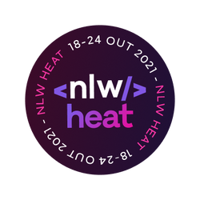

<h1 align="center">NLW Heat - React Native</h1>

    

 

  

  
  
  

  

  

  <a href="#Tecnologias">Tecnologias</a>&nbsp;&nbsp;&nbsp;|&nbsp;&nbsp;&nbsp;
  <a href="#sobre-o-projeto">Sobre o projeto</a>

## 🚀 Tecnologias

Esse projeto foi desenvolvido com as seguintes tecnologias:

- [React Native](https://reactnative.dev/)
- [Expo](https://expo.dev/)
- [TypeScript](https://www.typescriptlang.org/)
- [Socket.IO](https://socket.io/)
- [Moti](https://moti.fyi/)
## 💻 Sobre o projeto

DoWhile2021 é uma aplicação onde as pessoas podem compartilhar suas expectativas sobre o DoWhile.

  
  

  

> Projeto desenvolvido na missão Impulse do [NLW Heat](https://nextlevelweek.com/)